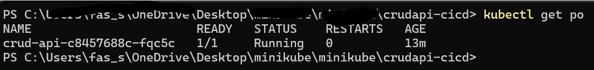
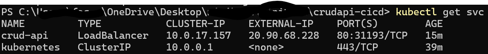
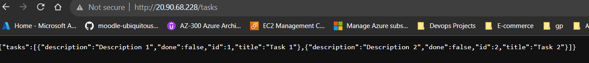

# Getting Started
This document will provide steps to create AKS cluster, Service Principal and CICD pipeline to build and deploy CRUD API(python) on AKS cluster using GitHub Action build and deploy pipeline. First of all clone the [repository](https://github.com/xitos2019/crudapi-cicd/tree/crud-api) to your local machine running below command.

```
git clone https://github.com/xitos2019/crudapi-cicd.git
```
This Repository Contains following directories.

* `.github\workflows\main.yaml` (contains yaml file for GITHUB Actions Pipeline)
  
* `curd-api\(app.py,deploy.yaml,dockerfile)` (python application,kubernetes manifest file,dockerfile) 
   
* `  Infra\main.tf,dev.tfvars,provider.tf,variables.tf` (Terraform script for AKS cluster)
   
* First of all we will create Service Principal authenticate AKS cluster with Github action by running below command.
  provide your subscription ID where you want to create Service Principal.

  `az ad sp create-for-rbac --name "sp-aks-dev" --role contributor --scope /subscriptions/mysubscription --sdk-auth`

Out put from above command which we will use as Azure Credentials secret in Github action.
```
{
  "clientId": "myclient ID",
  "clientSecret": "my client secret",
  "subscriptionId": "my subscription ID",
  "tenantId": "my tenant ID"
}
``` 
 * For Docker Image i have used [Dockerhub](https://hub.docker.com/repository/docker/fais786/crudapitest/general) registery where we will push docker images from `dockerfile` within `curd-api` folder and deploy on AKS cluster.

* To spin up AKS cluster and underlaying resources run below terraform command within Infra folder.
  
  `.\terraform.exe apply -var-file .\dev.tfvars`

* In GitHub Action we will creat repository secrets and  enviornment variables Navigate to
  
       **Github Repository-->Settings-->Secrets and Variables-->Actions**
  
and create below secrets to authenticate DockerHub Registery and Azure with Github Action  and enviornment variable.

  **Secrets** 

* DOCKER_REGISTRY (Docker hub registery name)
* DOCKER_REGISTRY_USERNAME (DockerHub Registery UserName)
* DOCKER_REGISTRY_PASSWORD (DockerHub Registery Access Token)
* AZURE_CREDENTIALS (Output from Service Principle creation )

**Enviornment Variable**

* CLUSTER_NAME (AKS Cluster Name)
* RESOURCE_GROUP (Resource Group)

**CICD Pipeline** 

I have created GITHUB Action CICD pipeline as yaml and configured 3 tasks.

* Build Dependencies 
* Build and push Docker image
* Deploy onto AKS cluster

Once all the tasks runs successfully we should see one application pod and service running.

`kubectl get po `



`kubectl get svc`



Below is curl output from service endpoint which confirms connectivity with our API also on browser we can confirm connectivity.

```
curl 20.90.68.228/tasks
{"tasks":[{"description":"Description 1","done":false,"id":1,"title":"Task 1"},{"description":"Description 2","done":false,"id":2,"title":"Task 2"}]}
```
Browser output.



**Improvements**

* We can set backend to set terraform state file remotely on storage account current script is saving state file locally.
* We can use either Azure KeyVault for Github Actions Secrets.
* We can use Nginx Ingress controller or Application Gateway for ingress on AKS cluster and route the traffic to application. 
